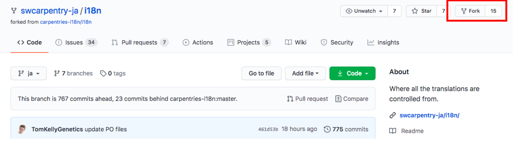

## Fork the repo

1. Click on the “Fork” button
  

## Clone/Download your fork

1. Make sure you are in your account and in the forked i18n repo
1. Click on “Clone”
1. Click on “HTTPS”
1. Click on the clipboard icon (this will copy the URL)
1. Go to terminal (or command line) and enter “git clone <URL>”
1. Check that there is an “i18n” folder
