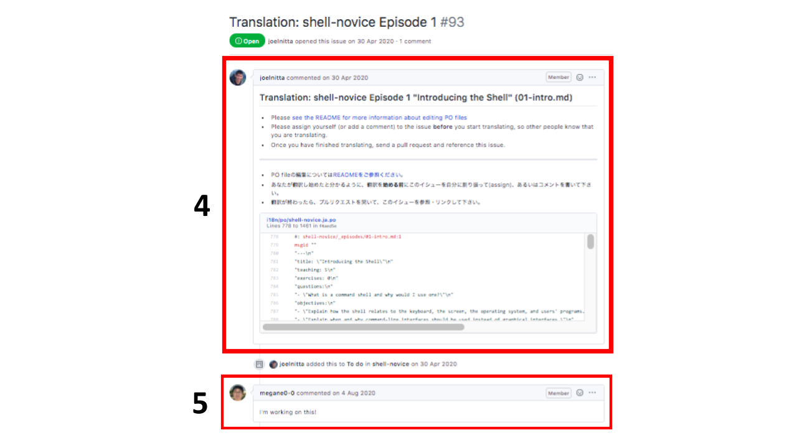

## リポジトリをforkする

1. “Fork” ボタンをクリックします

## あなたの fork を CloneもしくはDownload する

1. あなたのアカウントのi18nリポジトリにいることを確認します
1. “Clone” をクリックします
1. “HTTPS” をクリックします
1. クリップボードのアイコンをクリックします (これでURLがコピーされます)
1. ターミナル(もしくはコマンドプロンプト)に移動し “git clone <コピーしたURLをここに貼り付ける>” を実行します
1. “i18n” フォルダができていることを確認します

## どのレッスンを翻訳するか決める

1. SWC-jaの i18n リポジトリに移動します
1. “Issues” をクリックします
1. タイトルに “Translation:” がある issue のどれかをクリックします
1. 説明を読みます
1. この issue にコメントし、あなたがこの翻訳に取り組むことをSWC-jaのメンバーに知らせます (コメントの例:「私はこれに取り組みます!!」)

## 翻訳する

1. “i18n” フォルダに移動します
1. “po” フォルダに移動します
1. Find any file with “.ja.po” file extension
1. Translate with your favorite PO editor or directly edit the file

## Directly editing the file

1. Do NOT change “msgid”
1. Translate anything in between the quotation marks in the “msgstr” block only

