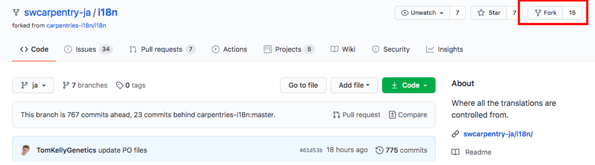

## リポジトリをforkする

1. “Fork” ボタンをクリックします

## あなたの fork を CloneもしくはDownload する

1. あなたのアカウントのi18nリポジトリにいることを確認します
1. “Clone” をクリックします
1. “HTTPS” をクリックします
1. クリップボードのアイコンをクリックします (これでURLがコピーされます)
1. ターミナル(もしくはコマンドプロンプト)に移動し “git clone <コピーしたURLをここに貼り付ける>” を実行します
1. “i18n” フォルダができていることを確認します

## Decide which lesson to translate

1. Go to SWC-ja’s i18n repo
1. Click on “Issues”
1. Click on any issue with “Translation” in the title
1. Read the description
1. Comment on the issue to let people know that you are working on this (e.g. “I am working on this!!”)

## Translate

1. Go to “i18n” folder
1. Go to “po” folder
1. Find any file with “.ja.po” file extension
1. Translate with your favorite PO editor or directly edit the file

## Directly editing the file

1. Do NOT change “msgid”
1. Translate anything in between the quotation marks in the “msgstr” block only

